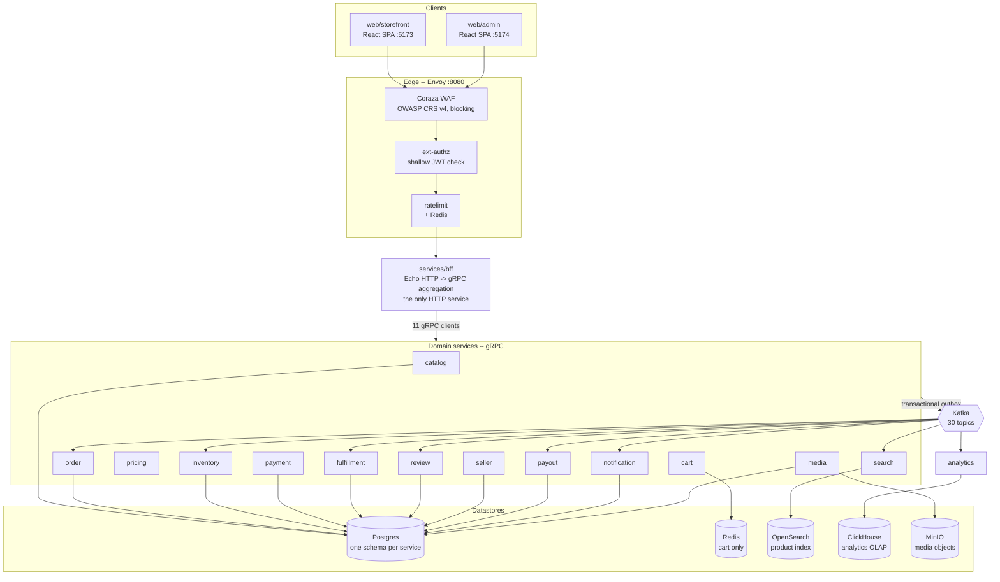
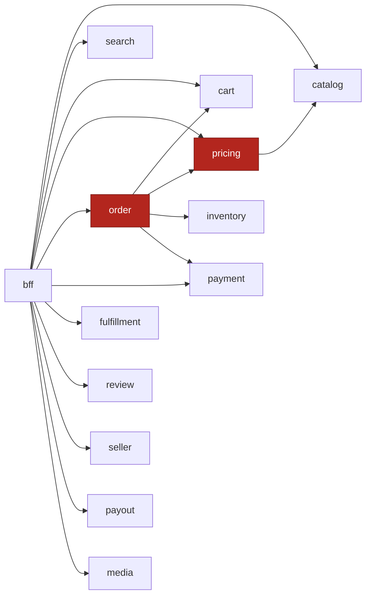
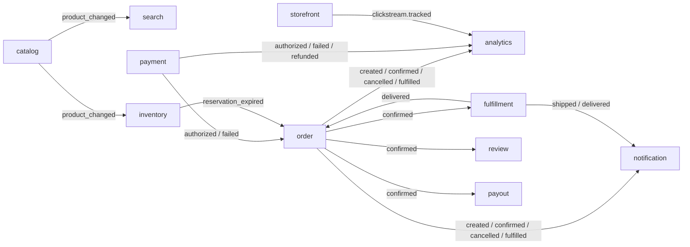
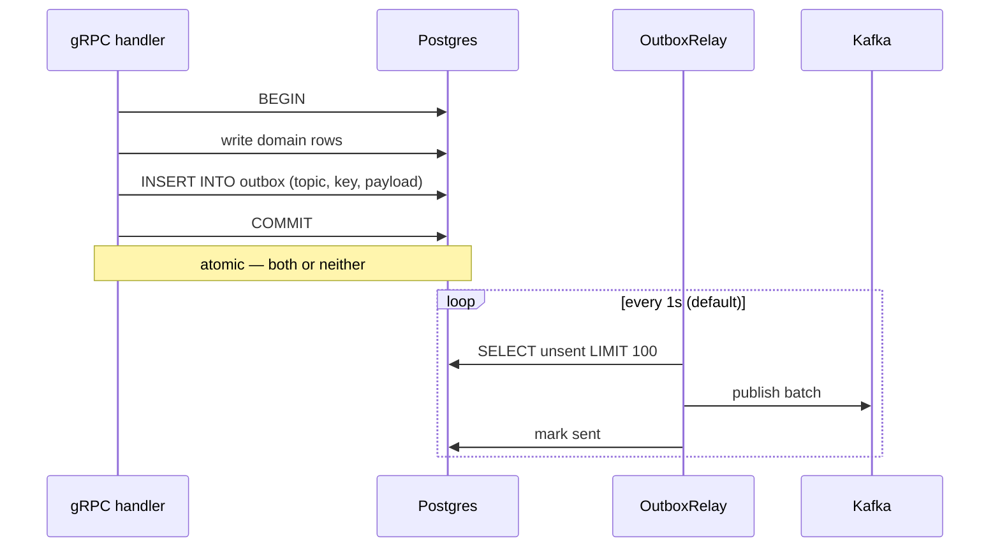
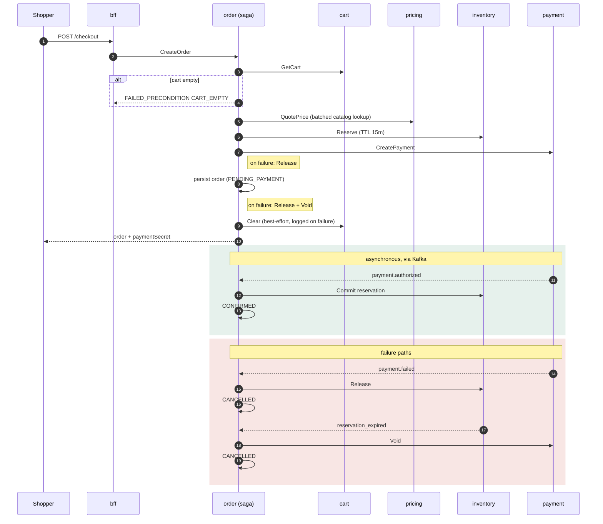

# Overview

A map of what is **actually built**, derived by reading the code rather than the design docs.

This complements the existing documentation rather than repeating it:

| Doc | What it is |
|---|---|
| [`docs/ARCHITECTURE.md`](docs/ARCHITECTURE.md) | The *intended* design and the reasoning behind it |
| [`docs/DECISIONS.md`](docs/DECISIONS.md) | ADR log — why each choice was made |
| [`docs/SETUP.md`](docs/SETUP.md) | How to run it, locally and in production |
| [`docs/SECURITY.md`](docs/SECURITY.md) | Scanner posture and the findings log |
| [`docs/RUNBOOKS.md`](docs/RUNBOOKS.md) | Operational procedures |
| **this file** | **What the code actually does today**, its real dependency edges, and where it will break first |

> Where the two disagree, this file wins — it was generated from the source. Known divergences
> are called out in [§9](#9-where-the-code-and-the-design-docs-disagree).

---

## 1. Scale

Measured from source, excluding `node_modules`:

| Area | Lines | Notes |
|---|---:|---|
| `services/` (non-test Go) | 12,273 | 16 services |
| `pkg/` (non-test Go) | 1,572 | 8 shared libraries |
| `gen/go/` | 17,139 | generated from 13 `.proto` files — never hand-edited |
| Go tests | 11,633 | ~0.95:1 test-to-source; most are real-dependency integration tests |
| `web/` TypeScript | 6,260 | 2 React SPAs |

18 independent Go modules under one `go.work` (16 services + `pkg` + `gen/go`). No module shares a
`go.sum` with another — this is why CI lints and tests each one separately, and why a dependency
pin has to be set workspace-wide to hold (see [§8](#8-structural-assumptions)).

---

## 2. System architecture



**The edge chain is ordered deliberately**: WAF first, so a malicious payload is dropped before
`ext-authz`, the rate limiter, or any service sees it.

`ext-authz` is **intentionally shallow** — it does a structural-only JWT check (`auth.ParseInsecure`),
never a signature verification. Real verification happens inside each service against Keycloak's
JWKS. The edge check exists to shed obviously-unauthenticated load cheaply, not to be the gate.

---

## 3. Service inventory

Each service is a separate Go module with the same internal shape:
`internal/domain` (business rules, no I/O) → `internal/store` (Postgres/pgx + goose migrations) →
`internal/grpcsvc` (thin handlers) → `main.go`.

| Service | RPCs | Store | Kafka consumer group | Outbox | OpenFGA |
|---|---:|---|---|:---:|:---:|
| `catalog` | 7 | Postgres | — | ✅ | ✅ |
| `order` | 11 | Postgres | `order-saga` | ✅ | ✅ |
| `seller` | 10 | Postgres | — | ✅ | ✅ |
| `payout` | 3 | Postgres | `payout` | ✅ | ✅ |
| `fulfillment` | 5 | Postgres | `fulfillment` | ✅ | — |
| `inventory` | 5 | Postgres | `inventory-catalog` | ✅ | — |
| `payment` | 4 | Postgres | — | ✅ | — |
| `review` | 4 | Postgres | `review` | ✅ | — |
| `notification` | 2 | Postgres | `notification` | ✅ | — |
| `media` | 3 | Postgres + MinIO | — | ✅ | — |
| `pricing` | 2 | Postgres | — | — | — |
| `cart` | 6 | **Redis only** | — | — | — |
| `search` | 2 | OpenSearch | `search-indexer` | — | — |
| `analytics` | 0 (health only) | ClickHouse | `analytics`, `analytics-clickstream` | — | — |
| `bff` | 0 (HTTP: 45 routes) | — | — | — | — |
| `ext-authz` | Envoy gRPC check | — | — | — | — |

`analytics` and `ext-authz` expose no domain RPCs — `analytics` is a pure Kafka→ClickHouse sink,
`ext-authz` implements Envoy's external-authorization contract.

---

## 4. Synchronous dependencies

Extracted from the `*_ADDR` env vars each service dials:



Only **three** services make synchronous outbound calls. Everything else is either called by the
BFF or driven purely by events — which keeps the synchronous blast radius small.

The two highlighted nodes are the depth problem: a checkout is `BFF → order → pricing → catalog`,
**four hops deep**, with `order` also fanning out to cart, inventory and payment on the same
request. See [§7](#7-core-workflow-the-checkout-saga).

---

## 5. Event flow

30 Kafka topics. Producers publish through a **transactional outbox** — the domain write and the
event row commit in the same Postgres transaction, and a relay goroutine drains the outbox table
to Kafka afterwards. This is what makes "order persisted but event lost" impossible.



Note the **cycle**: `order → payment → order`. That is the saga, not a design error — `order`
publishes `order.created`, `payment` reacts and publishes `payment.authorized`, and `order`'s
`order-saga` consumer advances the state machine on that event.

`commerce.order.confirmed.dlq` is the only dead-letter topic in the system — `order.confirmed` has
the most consumers (fulfillment, review, payout, notification, analytics), so it is the one path
where a poison message was considered worth isolating.

---

## 6. Data flow: the outbox relay



Defaults are set in [`pkg/kafka/outbox.go`](pkg/kafka/outbox.go): **1 second** poll interval,
**100 rows** per drain. Both matter operationally — see [§10](#10-bottlenecks-and-failure-modes).

Consumers must be **idempotent**, because this is at-least-once delivery. The pattern used
throughout is an `eventID` threaded into a store-level `Apply(ctx, id, eventID, fn)` that no-ops on
a replay.

---

## 7. Core workflow: the checkout saga

The most architecturally significant code in the repo:
[`services/order/internal/saga/saga.go`](services/order/internal/saga/saga.go).



**Forward path is synchronous, completion is asynchronous.** Steps 1–6 run inside the HTTP request;
confirmation arrives later over Kafka. The client polls (the storefront gives up after 15 polls
and shows the order as still pending).

Compensation is **explicit and best-effort**: `compensateRelease` and `compensateVoid` log failures
and return nothing. An order can therefore be cancelled while its stock reservation lingers until
the TTL expires. This is a deliberate trade — see [§8](#8-structural-assumptions).

`CONFIRMED → FULFILLED` requires **every** shop group in the order to report delivery
(`domain.Order.ShopGroups`), which is what makes a multi-seller order work.

---

## 8. Structural assumptions

These are load-bearing. Violating one breaks something non-obvious.

1. **Consumers are idempotent.** At-least-once delivery + outbox retries mean every handler will
   eventually see a duplicate. Enforced by convention (`eventID` + `Apply`), not by the type system.

2. **Compensation may silently fail.** The saga logs and moves on. Stock is reclaimed by the
   reservation TTL, not by the compensation succeeding. Set `ttl_seconds` too high and a failed
   checkout holds inventory for that long.

3. **The reservation TTL bounds the payment window.** Default 15 min, clamped to 60s–60m in
   `inventory`. A payment provider slower than the TTL loses the race to `OnReservationExpired`.

4. **Cart data is disposable.** `cart` is Redis-only with a TTL and no Postgres behind it. A Redis
   flush loses every active cart. Acceptable because carts are recoverable by the shopper; it would
   not be acceptable for orders.

5. **Search is eventually consistent.** A product is not findable until `search-indexer` consumes
   `catalog.product_changed`. Writes go to Postgres, reads to OpenSearch — they are never
   transactionally consistent with each other.

6. **Every service verifies its own JWT.** The edge check is structural only. A service reachable
   without going through Envoy is still protected; a service that *skips* `grpcx.WithAuth` is not.
   `search` deliberately registers with no auth interceptor because browse is anonymous.

7. **A dependency pin only holds workspace-wide.** With 18 modules and no shared `go.sum`, a
   per-service `go get` pin is reverted by the next `go mod tidy` anywhere. `go.work`'s `replace`
   is the only durable mechanism (this bit the repo twice with `moby/go-archive`).

8. **Local ≠ production at the edge.** Locally, Envoy in `deploy/compose/` is the edge. In
   production it is the Istio ingress gateway with Gateway API `HTTPRoute`s, and the mesh is
   ambient Istio. Edge behaviour fixed in one is **not** automatically fixed in the other.

---

## 9. Where the code and the design docs disagree

| `docs/ARCHITECTURE.md` says | Reality |
|---|---|
| An `identity` service exists (§3 service table) | **Never built.** Login/session brokering lives in [`services/bff/internal/auth/broker.go`](services/bff/internal/auth/broker.go) |
| A `web/login` SPA exists | **Never built.** Each React app has its own `pages/Login.tsx` |

Both are also flagged in [`CLAUDE.md`](CLAUDE.md). Nothing else in the design docs contradicts the
code as far as this pass could tell, but the service table is the section to distrust first.

---

## 10. Bottlenecks and failure modes

Ordered by how likely they are to bite, worst first.

### 10.1 Unbounded analytics buffer — memory exhaustion on a ClickHouse outage

[`services/analytics/internal/clickhouse/clickhouse.go`](services/analytics/internal/clickhouse/clickhouse.go)

`Add` appends to an in-memory slice and only flushes at `batchSize`. When a flush fails, `requeue`
**prepends the failed rows back**:

```go
func (s *Sink) requeue(rows []Event) {
    s.buf = append(rows, s.buf...)   // no cap, no drop policy
}
```

If ClickHouse is unavailable, the buffer grows without bound while new events keep arriving — the
service OOMs rather than shedding load. There is no max-buffer size, no drop-oldest policy, and no
circuit breaker. **This is the single most likely production incident in the repo.**

### 10.2 Outbox relay throughput ceiling

100 rows per 1-second tick = **~100 events/sec per service**, hard-capped by the defaults, and
every service constructs the relay as `NewOutboxRelay(pool, producer, 0, 0)` — i.e. always the
defaults, never tuned. A burst above that rate builds an ever-growing backlog in the outbox table,
and the 1s tick puts a **1-second floor** under every event's propagation latency.

### 10.3 Checkout latency is the sum of four synchronous hops

`cart → pricing (→ catalog) → inventory → payment`, all before the HTTP response. p99 checkout
latency is the **sum**, not the max, of those. Any one slow dependency slows every checkout.
Mitigating factors: `pricing` correctly uses `BatchGetProducts` (no N+1), and the slow part —
payment confirmation — is already asynchronous.

### 10.4 Hot-product lock contention

`inventory` takes `SELECT ... FOR UPDATE` row locks on stock rows during `Reserve`/`Commit`/
`Release`. Concurrent checkouts of the *same* product serialize on that row. Fine for a catalog with
spread demand; a flash sale on one SKU is a throughput wall.

### 10.5 BFF fan-in

One stateless process holds 11 gRPC clients and fronts every storefront and admin request. It
scales horizontally, but it concentrates blast radius and adds a hop. It is also the only HTTP
service, so it is where HTTP-level concerns (cookies, CORS, SSE) are necessarily centralized.

### 10.6 Single consumer group per event path

Parallelism for `order-saga` is bounded by the partition count of the four topics it consumes. Only
`order.confirmed` has a DLQ; a poison message on any other topic blocks its partition.

---

## 11. Repository layout

```
proto/                13 .proto files — the contract; buf generates gen/go
gen/go/               generated Go (17k lines, never hand-edited)
pkg/                  auth, config, errs, fga, grpcx, kafka, pgx, telemetry
services/<name>/
  ├── internal/domain/   business rules, no I/O
  ├── internal/store/    pgx + goose migrations
  ├── internal/grpcsvc/  thin gRPC handlers
  ├── internal/consumer/ Kafka handlers (where applicable)
  └── main.go            wiring only
web/storefront/       React + Vite + TS (shopper)
web/admin/            React + Vite + TS (operator)
deploy/compose/       local stack — Envoy, Postgres, Kafka, Keycloak, ...
deploy/docker/        one <service>.Dockerfile each (19)
deploy/helm/          Argo CD app-of-apps + commerce-services chart
deploy/istio/         Gateway API + ambient mesh manifests
infra/security/       ZAP plans, gitleaks + trivy config, go-coverage.sh
.github/workflows/    ci.yml, security.yml, perf.yml
```

**The shape is uniform on purpose.** Every service looks the same inside, so the interesting
differences — `cart` being Redis-only, `search` having no auth interceptor, `order` owning the saga
— stand out instead of hiding in structural noise.
