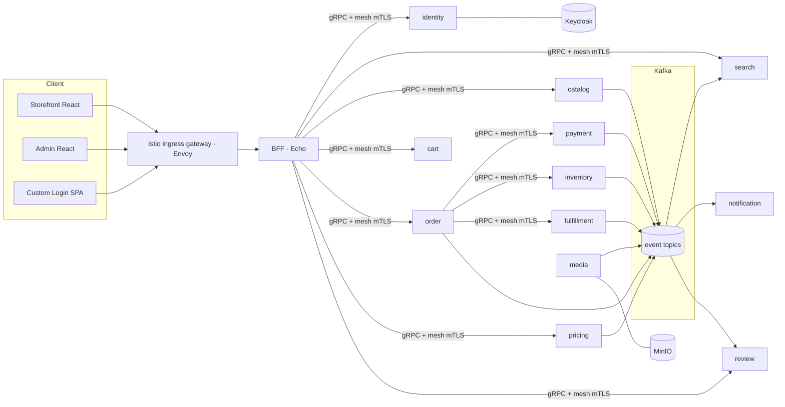
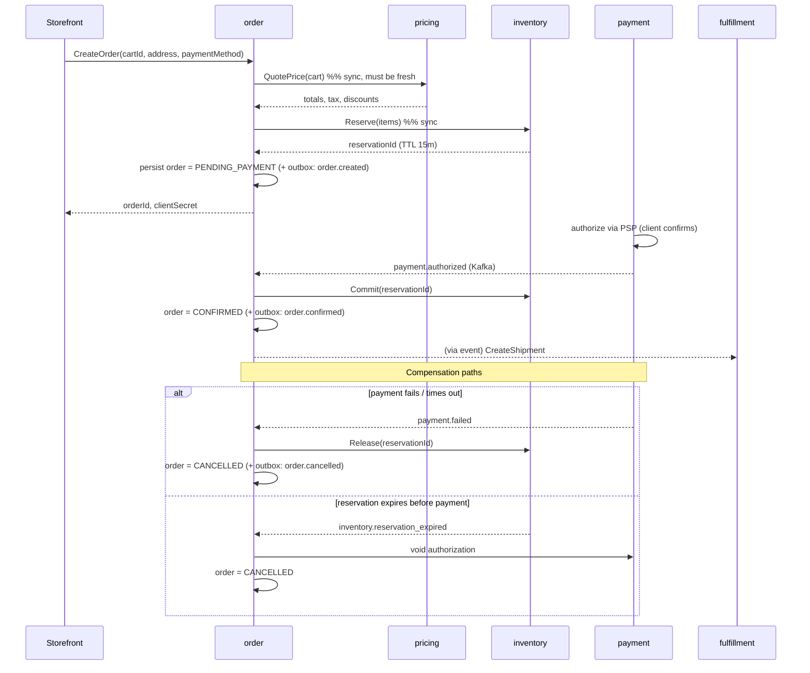

# Architecture

Status: **design**. This document is the blueprint the implementation follows.

## Contents

1. [Goals and constraints](#1-goals-and-constraints)
2. [Technology decisions](#2-technology-decisions)
3. [Service decomposition (bounded contexts)](#3-service-decomposition-bounded-contexts)
4. [Communication: gRPC + Kafka](#4-communication-grpc--kafka)
5. [Data architecture](#5-data-architecture)
6. [The checkout saga](#6-the-checkout-saga)
7. [Identity, AuthN, and RBAC](#7-identity-authn-and-rbac)
8. [Edge & mesh: Istio ambient + ingress gateway + BFF](#8-edge--mesh-istio-ambient--ingress-gateway--bff)
9. [Deployment: Docker → Kubernetes → Helm](#9-deployment-docker--kubernetes--helm)
10. [Observability and dashboards](#10-observability-and-dashboards)
11. [Scalability and resilience](#11-scalability-and-resilience)
12. [Security](#12-security)
13. [Local development and CI](#13-local-development-and-ci)
14. [Build-out roadmap](#14-build-out-roadmap)

> **Every "why" is recorded** — for the reasoning behind each choice below (including
> decisions that were made, reversed, and remade), see [`DECISIONS.md`](DECISIONS.md).

---

## 1. Goals and constraints

| Goal | What it means here |
|---|---|
| **Horizontally scalable** | Every service is stateless; all state is in Postgres/Redis/Kafka/OpenSearch/MinIO. Scale = more pods. |
| **Independently deployable** | One service can ship without a coordinated release, as long as gRPC contracts stay backward-compatible (enforced by `buf`). |
| **Resilient to partial failure** | A down `review` service must not stop checkout. Timeouts, circuit breakers, and async fallbacks everywhere on non-critical paths. |
| **Secure by default** | mTLS internally, JWT verified at every hop, least-privilege RBAC, no secrets in images, security scanning gates the pipeline. |
| **Observable** | Every request is traced end to end; every service exports RED metrics; business KPIs are first-class dashboards. |
| **Operable by two people** | Monorepo, one runtime (Go), one deploy tool (Helm + Argo CD), one dashboard tool (Grafana), GitOps. The one place we spend operational complexity **on purpose** is the service mesh (§8) — it removes more custom code (mTLS, retries, traffic policy, circuit breaking) than it adds, and gives one data plane edge-to-internal. |

**Non-goals for v1:** multi-region active-active, multi-tenant marketplace (single first-party
seller assumed — the model leaves room for it), and a mobile app (the storefront is
responsive web).

---

## 2. Technology decisions

### 2.1 Language & HTTP framework — Go, with Echo only at the edge

**All services are Go.** One toolchain, one set of shared `pkg/` libraries, fast cold starts
(good for HPA), small containers.

**Echo** is the HTTP framework — but *only* in the **BFF** and any service exposing a public
REST/webhook surface (e.g. `payment` receives PSP webhooks). Rationale:

- Built on `net/http` → works with `otelhttp`, `grpc-gateway`, and the wider ecosystem
  unchanged. (This is the single reason to **not** pick **Fiber**, which uses `fasthttp`.)
- Middleware for recovery, request ID, CORS, gzip, body limit, rate limit, JWT — batteries
  included without being a monolith framework.
- Actively maintained, stable v4 API, trivial to test with `httptest`.

**Gin** and **Chi** are both acceptable substitutes; the design does not depend on Echo
specifics. What the design *does* depend on: the framework is `net/http`-compatible and the
public HTTP surface is thin — real work happens over gRPC.

**Internal service-to-service traffic is gRPC only.** No service calls another service's HTTP
endpoint.

### 2.2 Datastores

| Store | Version | Role | Notes |
|---|---|---|---|
| **PostgreSQL** | 16 | System of record. One logical database per service; no cross-service joins, no shared tables. | `pgx/v5` driver. Migrations with `goose` or `atlas`. `JSONB` for product attributes / config. Partition `orders`, `order_events` by month. |
| **Redis** | 7 | Cart contents (TTL), session lookup cache, rate-limit counters, idempotency keys, `SETNX` distributed locks, hot catalog read-through cache. | Redis Cluster or a managed equivalent in prod. Never the system of record for anything durable. |
| **OpenSearch** | 2.x | Catalog search: full-text, faceted filters, autocomplete, "did you mean", relevance boosting. | Fed **only** by the `search` service consuming `catalog.*` and `inventory.*` Kafka events — never dual-written. |
| **Kafka** | 3.x (KRaft) | Event backbone: domain events, transactional outbox relay, CDC sink, analytics fan-out, DLQ. | 3 brokers min in prod. Schema Registry + Protobuf for event schemas. |
| **MinIO** | latest | S3-compatible object storage: product images/video, generated invoices (PDF), data exports, archived security-scan reports. | `media` service is the only writer. Presigned URLs for client uploads/downloads. Versioning + lifecycle rules on. |
| **ClickHouse** *(optional, phase 2)* | latest | Clickstream / analytics events for funnel and merchandising dashboards. | Kafka → ClickHouse via the Kafka table engine. Keep out of v1 if Grafana + Postgres reporting is enough. |

**Why Postgres over MongoDB / MySQL / CockroachDB for v1:** orders, payments, inventory
reservations, and the promotions ledger are relational and need real transactions and
constraints. `JSONB` handles the genuinely flexible parts (catalog attributes, per-service
config). CockroachDB is the drop-in scale-out path if a single primary + read replicas is
ever exhausted — the schema-per-service, no-cross-service-join rule keeps that migration
local. MySQL is fine but Postgres's `JSONB`, partial indexes, `LISTEN/NOTIFY`, and logical
replication (for Debezium CDC) are worth more here.

### 2.3 Supporting infra

- **Keycloak** — OIDC provider, user store, RBAC source of truth. See §7.
- **Istio (ambient mode)** — the service mesh. `ztunnel` (per-node) gives L4 mTLS between
  every service with zero app code; `waypoint` proxies add L7 policy (routing, retries,
  outlier detection, `AuthorizationPolicy`) only in the namespaces that need it. **Same Envoy
  data plane** is used at the edge (below). See §8 — and [`DECISIONS.md` ADR-011/012](DECISIONS.md)
  for why this over Kong.
- **Istio ingress gateway** (Envoy, configured via **Gateway API** — `Gateway` + `HTTPRoute`)
  — the single north-south entry point: TLS termination, host/path routing, weighted/canary
  routing, traffic mirroring. Rate limiting and the shallow edge auth-check are delegated to
  small dedicated services (§8.3–8.4). Does **not** do authoritative JWT verification.
- **cert-manager** — public TLS certs (Let's Encrypt) for the ingress gateway. Internal mesh
  mTLS certs are issued by **istiod** (its own CA), not cert-manager.
- **External Secrets Operator** + **HashiCorp Vault** (or cloud secrets manager) — no
  long-lived secrets in Git or images.
- **Argo CD** — GitOps: the cluster reconciles to `deploy/helm/` on `main`.

---

## 3. Service decomposition (bounded contexts)

Each is a separate Go module, database, Helm subchart, and deployable. Ownership boundaries
are drawn so that the **critical checkout path** touches as few services as possible.

| Service | Owns | Sync API (gRPC) | Publishes (Kafka) | Consumes |
|---|---|---|---|---|
| **bff** | Nothing — aggregation + auth cookie + gRPC-Web bridge | — | — | — |
| **identity** | Users↔roles mapping, custom-login flows, Keycloak brokering, API-key issuance for webhooks | `Login`, `Refresh`, `Register`, `StartRecovery`, `GetPrincipal` | `user.registered`, `user.role_changed` | — |
| **catalog** | Products, variants, categories, attributes, media references | `GetProduct`, `ListProducts`, `BatchGetProducts` | `catalog.product_changed`, `catalog.category_changed` | `media.asset_ready` |
| **search** | Search index (OpenSearch), query + autocomplete | `Search`, `Autocomplete`, `Facets` | — | `catalog.*`, `inventory.stock_changed`, `pricing.price_changed` |
| **inventory** | Stock levels per warehouse, reservations, backorders | `CheckAvailability`, `Reserve`, `Release`, `Commit` | `inventory.stock_changed`, `inventory.reservation_expired` | `order.cancelled` |
| **cart** | Active carts (Redis), merge on login | `GetCart`, `AddItem`, `UpdateItem`, `RemoveItem`, `Clear` | `cart.checked_out` | `catalog.product_changed` (price/label refresh) |
| **pricing** | List prices, promotions, coupons, tax rules, price calculation | `QuotePrice`, `ValidateCoupon`, `ApplyPromotions` | `pricing.price_changed`, `pricing.promotion_changed` | — |
| **order** | Order aggregate, checkout **saga orchestrator**, order state machine, **returns (RMA)** | `CreateOrder`, `GetOrder`, `ListOrders`, `CancelOrder`, `RequestReturn`, `GetReturn`, `ListReturns`, `DecideReturn` | `order.created`, `order.confirmed`, `order.cancelled`, `order.fulfilled`, `order.return_requested`, `order.return_approved`, `order.return_rejected` | `payment.*`, `inventory.*`, `fulfillment.*` |
| **payment** | Payment intents, PSP integration, **partial/cumulative refunds**, webhook ingestion | `CreatePayment`, `ConfirmPayment`, `Refund`, `Void` | `payment.authorized`, `payment.failed`, `payment.refunded` | `order.created`, `order.cancelled` |
| **fulfillment** | Shipments (one per order in v1), sandbox carrier, tracking | `GetShipment`, `ListShipments`, `MarkShipped`, `MarkDelivered`, `CancelShipment` | `fulfillment.shipment_created`, `fulfillment.shipped`, `fulfillment.delivered`, `fulfillment.cancelled` | `order.confirmed` |
| **notification** | Transactional notifications: templates, delivery history, sandbox channel | `ListNotifications`, `SendTest` | `notification.sent` | `order.created`, `order.confirmed`, `order.cancelled`, `order.fulfilled`, `fulfillment.shipped`, `fulfillment.delivered` |
| **review** | Product ratings & reviews, verified-purchase index, moderation | `CreateReview`, `ListReviews`, `GetRatingSummary`, `ModerateReview` | `review.published`, `review.hidden` | `order.confirmed` (verified-purchase index) |
| **media** | Upload intake (MinIO), image derivatives, AV scan, CDN origin | `CreateUploadURL`, `GetAsset` | `media.asset_ready`, `media.asset_rejected` | — |

**Read-side note:** the `search` service is the query engine for product listing/browse. The
storefront hits `search` for listing pages and `catalog` only for the product-detail page
(canonical data). This keeps browse traffic — the bulk of load — off the transactional DB.



---

## 4. Communication: gRPC + Kafka

### 4.1 When to use which

- **gRPC (synchronous)** — the caller needs an answer *now* to proceed: `CheckAvailability`
  during checkout, `QuotePrice` when rendering the cart, `GetProduct` for a detail page.
- **Kafka (asynchronous events)** — something happened and other services may care, but the
  producer doesn't wait: `order.confirmed`, `inventory.stock_changed`. Producers never know
  who consumes.

Rule of thumb: **commands** (do this now) → gRPC; **events** (this happened) → Kafka. If a
sync call is only there to notify, it should be an event.

### 4.2 gRPC conventions

- Contracts live in `proto/commerce/<domain>/v1/`. `buf lint` + `buf breaking` run in CI
  against `main` — a breaking change fails the build.
- Versioned packages (`v1`, `v2`) — never break `v1`, add `v2` and dual-serve.
- Standard interceptors from `pkg/grpcx` on every server and client:
  auth (JWT verify + inject principal), logging + trace propagation, panic recovery,
  deadline enforcement (default 3s, checkout-path calls 1s), per-method application rate
  limit (business quotas — coarse transport retries/timeouts/outlier-detection are the
  **mesh's** job, not the interceptor's).
- **mTLS between services is provided by the Istio ambient mesh** (`ztunnel`), transparently
  — no TLS config, no SPIFFE SVID loading, no cert rotation code in `pkg/grpcx`.
  `PeerAuthentication: STRICT` mesh-wide means a non-mesh client simply cannot connect.
- Health: `grpc.health.v1.Health` on every service → k8s readiness/liveness probes.
- Payload limits: 4 MB default; media never travels through gRPC — it's presigned MinIO URLs.

### 4.3 Kafka conventions

- **Topics:** `commerce.<domain>.<event>` e.g. `commerce.order.confirmed`. Compacted topics
  for "latest state" streams (`catalog.product_changed`), time-retained (7–30d) for the rest.
- **Schemas:** Protobuf messages in `proto/commerce/<domain>/v1/events.proto`, registered in
  Schema Registry. Backward-compatible evolution only.
- **Keys:** partition by the aggregate id (`order_id`, `product_id`) so a single aggregate's
  events stay ordered.
- **Delivery:** at-least-once. Every consumer is **idempotent** (dedupe on event id in Redis
  or a Postgres `processed_events` table).
- **Transactional outbox:** services write domain rows + an `outbox` row in the **same
  Postgres transaction**; a relay (Debezium, or a simple poller in `pkg/kafka`) publishes
  outbox rows to Kafka. No dual-write, no lost events.
- **DLQ:** `commerce.<domain>.<event>.dlq` after N failed retries; an alert fires on any DLQ
  depth > 0.

---

## 5. Data architecture

### 5.1 Database per service

Each service owns its schema and is the **only** writer. Others get its data via gRPC (fresh
read) or by consuming its events (local projection). No shared tables, no cross-service
foreign keys, no "just this one join".

Physically this can be one Postgres cluster with a database (or schema) per service in dev,
splitting to separate clusters for `order`/`payment`/`inventory` as load demands — the
application code doesn't change because it never assumed co-location.

### 5.2 Consistency model

- **Within a service:** ACID Postgres transactions.
- **Across services:** eventual consistency via events, with the **saga pattern** for
  workflows that must not half-complete (checkout — see §6).
- **Idempotency:** every state-changing gRPC method and HTTP endpoint takes an
  `Idempotency-Key` / request id; results are cached (Redis, 24h) so retries are safe.

### 5.3 Caching

- Read-through cache in `pkg/pgx` helpers for hot, rarely-changing data (categories, active
  promotions) — Redis, short TTL, invalidated on the matching Kafka event.
- The `search` index is itself a cache of catalog+inventory+pricing, kept warm by events.
- HTTP caching headers at the gateway for anonymous catalog/browse responses; a CDN in front
  in production.

### 5.4 Object storage (MinIO)

- Client requests an upload → `media.CreateUploadURL` returns a presigned `PUT` scoped to one
  key, size-limited, content-type-locked.
- After upload, `media` runs an antivirus scan (ClamAV sidecar) + generates derivatives
  (thumbnails, webp) → emits `media.asset_ready` with the canonical keys.
- `catalog` stores only the object keys, never bytes.
- Buckets: `product-media` (public-read via CDN), `invoices` (private, presigned GET only),
  `exports` (private, short-lived), `security-reports` (private, CI-written).
- Versioning on; lifecycle rule expires `exports/*` after 7 days.

---

## 6. The checkout saga

Checkout spans `cart`, `pricing`, `inventory`, `order`, `payment`, `fulfillment`. It must
either fully complete or fully compensate. `order` is the **orchestrator** — it holds the
saga state machine in its own DB and drives each step, reacting to events.



- **Reservations have a TTL** (15 min). `inventory` emits `reservation_expired` on lapse;
  the saga compensates.
- Every step is **idempotent** and retried with backoff; terminal failure → order
  `CANCELLED` + customer notified via `notification`.
- Saga state transitions are persisted before side effects, so a crashed orchestrator
  resumes from the last durable state on restart.
- **No distributed transactions, no 2PC.** Compensations, not rollbacks.

---

## 7. Identity, AuthN, and RBAC

### 7.1 Keycloak as the IdP

- One realm (`commerce`). Clients:
  - `storefront-web` — public client, Authorization Code + PKCE.
  - `admin-web` — public client, Authorization Code + PKCE, stricter session timeouts.
  - `bff` — **confidential** client, used when the BFF brokers custom-login.
  - `internal` — service accounts for machine-to-machine where needed.
- Tokens: short-lived access (5 min), refresh (SPA: 30 min sliding, admin: 15 min).
- Brute-force detection **on**. Password policy, email verification, and (for admin)
  required OTP configured in the realm.
- Realm export lives in `deploy/compose/keycloak/realm-commerce.json` and is imported on
  local startup (gives you `testuser` / `testuser123`).

### 7.2 Custom login — not the Keycloak default page

Two supported approaches; **the platform ships approach A, with B documented as the
fallback if a Keycloak upgrade path or MFA-heavy requirement makes A costly.**

**A. Custom React login SPA → BFF brokers to Keycloak (Resource Owner flow, first-party).**
```
web/login (React)  ──POST /auth/login {username,password}──▶  BFF
BFF (confidential client)  ──grant_type=password──▶  Keycloak /token
BFF  ──sets httpOnly, Secure, SameSite=Lax cookie (access+refresh)──▶  browser
```
- Full control of the UI/UX; no redirect to a Keycloak-hosted page.
- Tokens **never touch `localStorage`** — the BFF holds them in an encrypted httpOnly
  cookie and attaches the bearer to downstream gRPC-Web calls. XSS can't exfiltrate them.
- Keycloak still enforces password policy, brute-force lockout, and account state.
- MFA/step-up: use Keycloak **Application-Initiated Actions** — the BFF gets a
  `CONFIGURE_TOTP` / `totp required` response and the React app renders the OTP step itself,
  posting back through the BFF. Password reset and email verification are handled the same
  way (custom React screens calling Keycloak's account/recovery endpoints via the BFF).
- Trade-off: you own more flows (reset, verify, OTP enrolment) as UI. Social login, if ever
  needed, still uses a redirect.

**B. Custom Keycloak theme (FreeMarker + your CSS/JS bundle).**
- Login page is still served by Keycloak (Authorization Code + PKCE, standard redirect) but
  is 100% your branding/markup.
- You get **every** Keycloak flow for free — MFA, recovery, social, WebAuthn, consent — with
  zero custom flow code.
- Trade-off: it's a redirect to `/realms/commerce/...`, and the theme is FreeMarker, not
  React. Best when standards-compliance and flow coverage matter more than a same-origin SPA
  feel.

> Recommendation: start with **B** to ship auth fast and correct, migrate the login/register
> screens to **A** if product wants the same-origin SPA experience. The BFF cookie handling
> in **A** is the part to get right regardless.

### 7.3 RBAC

- **Roles** are Keycloak **realm roles**, assigned via **groups**:

  | Role | Grants |
  |---|---|
  | `customer` | shop, manage own cart/orders/addresses/reviews |
  | `csr` | read any order, issue refunds up to a limit, resend notifications |
  | `catalog_manager` | CRUD products/categories/media, manage search synonyms |
  | `inventory_manager` | adjust stock, manage warehouses, view reservations |
  | `pricing_manager` | manage prices, promotions, coupons, tax rules |
  | `order_manager` | full order lifecycle actions, cancellations, manual overrides |
  | `finance` | payments/refunds reporting, reconciliation exports |
  | `admin` | all business operations (composite of the managers above) |
  | `platform_admin` | user/role administration, feature flags, system config |

- Roles ride in the JWT (`realm_access.roles`). `pkg/auth` provides:
  - A **gRPC interceptor** and **Echo middleware** that verify the token against Keycloak
    **JWKS** (keys cached, refreshed on `kid` miss), check `iss`/`aud`/`exp`, and inject a
    `Principal{Subject, Roles, Email}` into context.
  - `RequireRole("order_manager")` / `RequireAnyRole(...)` guards per RPC / route.
- **Resource-level** checks (e.g. "a customer may only read *their own* order") are enforced
  in each repository layer by `owner_id == principal.Subject`, never by role alone.
- **Optional fine-grained layer (phase 2):** OpenFGA or Casbin for relationship-based rules
  if a marketplace / team-account model appears. The interface in `pkg/auth` is designed so
  this slots in without touching call sites.
- The **ingress gateway + `ext-authz` service** do coarse edge checks (is there a token at
  all, is it structurally valid and unexpired, is the route admin-only) and the mesh's
  `AuthorizationPolicy` enforces which service may call which — but the **authoritative**
  identity/role check is always in the service via `pkg/auth` (§8.3).

---

## 8. Edge & mesh: Istio ambient + ingress gateway + BFF

Three layers, three jobs. **Mesh = transport (mTLS, traffic policy). Ingress gateway =
north-south entry. BFF = view composition + the auth-cookie boundary.** See
[`DECISIONS.md` ADR-011/012/013](DECISIONS.md) for the full "why Envoy/Istio, not Kong"
write-up — including that Kong was chosen first, implemented, then reversed once
team-familiarity was taken off the table.

```
Browser ──HTTPS/JSON──▶ Istio ingress gateway (Envoy) ──▶ BFF (Echo) ══mesh mTLS══▶ services
PSP     ──HTTPS webhook─▶ Istio ingress gateway (Envoy) ──▶ payment
                                 │
                         Gateway API: Gateway + HTTPRoute
                                 │
                         ext-authz (shallow token check) · ratelimit svc (envoyproxy/ratelimit + Redis)
```

### 8.1 The mesh — Istio, ambient mode

| Choice | Decision | Why |
|---|---|---|
| Mesh vs no mesh | **Mesh** | mTLS between all 13 services is a hard requirement (§4.2/§12). A mesh delivers it with zero app code and no cert-rotation logic to own; it also gives per-request gRPC load balancing (nginx/Kong balance per *connection* — long-lived gRPC channels then starve new replicas). |
| Ambient vs sidecar | **Ambient** | No per-pod sidecar (no injection webhook, no pod restart to upgrade the proxy, ~no per-pod memory tax). `ztunnel` DaemonSet does L4 + mTLS for everything; `waypoint` proxies are added **only** in `order` / `payment` / `inventory` namespaces where L7 policy (retries, outlier detection, `AuthorizationPolicy` on specific methods) is actually needed. |
| Istio vs Linkerd | **Istio** | Linkerd's proxy isn't Envoy, so it wouldn't unify with the edge; its L7 traffic-management and Gateway API story are thinner. |
| CA | **istiod** issues workload certs (SPIFFE identities) and rotates them. cert-manager is only for the public-facing ingress cert. |

Mesh-level config in `deploy/istio/`:
- `PeerAuthentication` → `STRICT` mesh-wide (plaintext rejected).
- `AuthorizationPolicy` per namespace: default-deny, then explicit allows — e.g. only `bff`
  and `order` may call `payment`; only `order` may call `inventory.Reserve/Commit/Release`.
  This is defense-in-depth alongside Kubernetes `NetworkPolicy` (§9.2): NetworkPolicy is
  L3/L4 pod-selector, `AuthorizationPolicy` is L7 identity + path/method.
- `Telemetry` → traces + metrics to the OTEL collector, so the mesh hop shows up in the same
  trace as the app spans.

### 8.2 Ingress gateway — Envoy via Gateway API

| Choice | Decision | Why |
|---|---|---|
| Implementation | **Istio ingress gateway** (same Envoy build as the mesh) | One data plane edge-to-internal: one proxy to learn, tune, patch, observe. |
| Config API | **Gateway API** (`Gateway`, `HTTPRoute`, `ReferenceGrant`) — not Ingress, not vendor CRDs | Portable standard; the *same* `HTTPRoute` resources run under plain Envoy Gateway locally (§13.1). |
| Placement | `Service type=LoadBalancer`; terminates TLS with a cert-manager `Certificate`. No nginx-ingress in front. |
| Routing | Host/path → BFF (storefront, admin) and `payment` (PSP webhooks only). **Weighted routing** on `HTTPRoute` `backendRefs` powers canary; `RequestMirror` filter shadows traffic to a new version. |

Edge cross-cutting concerns, and where each lives now that there are no Kong plugins:

| Concern | How | Note |
|---|---|---|
| TLS termination | Gateway `listeners` + cert-manager | — |
| CORS | `HTTPRoute` `CORS` filter (Gateway API) / a small `EnvoyFilter` | One place, per-env origins. |
| Rate limiting | **`ratelimit` service** (`envoyproxy/ratelimit` + Redis) wired via the gateway's global rate-limit config | Cluster-wide counters. Tight descriptors on `/auth/*`, loose on browse. Replaces Kong `rate-limiting-advanced`. |
| Shallow auth pre-check | **`ext-authz` service** (tiny Go service) called via Envoy `ext_authz` | "Token present, structurally valid, not expired, route allowed" — **not** the authoritative check (§8.3). Alternative: fold this into the BFF and let the gateway only rate-limit. |
| Request-size limit | Envoy `max_request_bytes` on the listener | Uploads bypass the gateway entirely (presigned MinIO PUT). |
| Admin IP allow-list | `AuthorizationPolicy` on the gateway matching `admin.*` host + source IP block | Replaces Kong `ip-restriction`. |
| Correlation id | Envoy `request_id` + `x-request-id` propagation; `pkg/telemetry` adopts it | — |
| Metrics | Envoy → Prometheus (Istio's standard metrics) → **Platform overview** dashboard | — |
| Tracing | Istio `Telemetry` → OTEL collector | Trace starts at the gateway span. |
| Maintenance mode | `HTTPRoute` swapped to a `direct-response` 503 route | Replaces Kong `request-termination`. |

### 8.3 Auth at the edge — deliberately shallow

The `ext-authz` service does a **cheap pre-check only**: token/cookie present on a protected
route, structurally valid, unexpired, route not admin-only-for-a-non-admin. It does **not**
verify the RS256 signature as the source of truth.

- The **authoritative** verification — JWKS fetch + cache (refresh on `kid` miss) +
  `kid`/`iss`/`aud`/`exp` checks + role extraction — is in `pkg/auth`, run by **every
  service** on **every** gRPC call.
- Rationale: shed unauthenticated load early, without a second drift-prone copy of the trust
  logic at the edge. `ext-authz` shares the `pkg/auth` token-parse code but is explicitly
  configured *not* to be trusted for identity — services re-verify regardless.

### 8.4 WAF

Envoy has no built-in WAF. Options, in preference order:
1. **Coraza (OWASP CRS) as an Envoy Wasm/`ext_proc` filter** on the ingress gateway — runs
   the CRS ruleset in the gateway itself. Recommended.
2. A managed WAF at the cloud LB in front of the gateway (AWS WAF / Cloudflare) if already on
   that cloud.

### 8.5 BFF (`services/bff`, Echo)

One per client family (`storefront`, `admin`) or one binary with route groups.
Responsibilities the gateway/mesh **cannot** do:
- Terminates the auth cookie (login approach A/B), holds Keycloak tokens server-side,
  attaches bearers to downstream gRPC calls.
- **Aggregation**: a product-detail page = `catalog.GetProduct` + `pricing.QuotePrice` +
  `review.ListReviews` + `inventory.CheckAvailability` fanned out concurrently, composed into
  one response.
- gRPC status → HTTP status (`pkg/errs`); strips internal error detail.
- Per-view response shaping so the React apps aren't chatty.
- No datastore of its own.

The React apps talk **only** to the ingress gateway → their BFF (REST/JSON over HTTPS). They
never hold a gRPC client and never call a domain service directly.

### 8.6 Why the mesh/gateway *and* a BFF, not one or the other

- **Gateway without a BFF** → the React apps call many services and do their own aggregation,
  error mapping, and token handling in the browser; tokens end up in JS.
- **BFF without the gateway/mesh** → every service re-implements TLS, and the BFF
  re-implements rate limiting, CORS, IP allow-listing, edge metrics/tracing, canary routing,
  and maintenance mode; no single choke point.
- Together: the mesh owns transport uniformly, the gateway owns north-south L7 infra, the BFF
  owns view composition and the auth-cookie boundary. Clear seams, no overlap.

### 8.7 What this costs (accepted)

- **Heavier to stand up** than `helm install <gateway>`: istiod + `ztunnel` DaemonSet + Istio
  CNI + the gateway. More cluster moving parts; a misbehaving mesh is harder to debug.
- **Rate-limit and ext-authz are small services we run**, not plugins we toggle.
- **No built-in response cache** — prod puts a CDN in front; the BFF has Redis read-through
  for anonymous browse (§5.3).
- **Local dev diverges**: docker-compose runs plain **Envoy Gateway** (same `HTTPRoute`s),
  no mesh, plaintext between containers (§13.1).

These were weighed against Kong and accepted — see [`DECISIONS.md` ADR-011](DECISIONS.md).

---

## 9. Deployment: Docker → Kubernetes → Helm

### 9.1 Images

- Multi-stage: `golang:1.26` build stage → **distroless** (`gcr.io/distroless/static`) or
  Chainguard runtime. Final image is a single static binary, non-root `USER 65532`,
  read-only root filesystem, no shell.
- One Dockerfile per service under `deploy/docker/`, sharing a common base.
- Images tagged with the Git SHA; `latest` is never deployed.
- **SBOM** (`syft`) generated and attached; image **signed** with `cosign`; provenance
  attestation (SLSA level 3 target) in CI.

### 9.2 Kubernetes

Per service:
- `Deployment` (min 2 replicas in prod), `Service` (ClusterIP), `ServiceAccount` (unique,
  minimal RBAC).
- **Probes:** gRPC liveness + readiness on the health service; `startupProbe` for
  migration-on-boot services.
- **Resources:** requests set from load-test p95, limits ~2×; `GOMEMLIMIT` set from the
  memory limit.
- **HPA** on CPU + custom metrics. **KEDA** `ScaledObject` on **Kafka consumer lag** for
  `search`, `notification`, `media`; on **gRPC RPS** for `bff`, `catalog`, `search`.
- `PodDisruptionBudget` (`minAvailable: 1` / `50%`).
- **NetworkPolicy** (L3/L4): default-deny ingress+egress per namespace; explicit allows
  (`bff → domain services`, `order → payment/inventory/fulfillment`, `* → its own DB`,
  `* → Kafka`, `* → otel-collector`). No service can reach another service's DB.
- **Istio `AuthorizationPolicy`** (L7 identity + path/method): default-deny, explicit allows
  by SPIFFE identity — complements NetworkPolicy, doesn't replace it (§8.1).
- **Pod Security Standards: `restricted`** enforced by namespace label.
- `topologySpreadConstraints` across zones; anti-affinity so replicas don't co-locate.
- Namespaces labelled `istio.io/dataplane-mode=ambient` to join the mesh; `waypoint`
  proxies deployed in `order` / `payment` / `inventory` only.

**Mesh & gateway components** (installed as a platform prerequisite, before any service):
`istio-base`, `istiod`, `istio-cni`, `ztunnel` (DaemonSet), and the ingress `Gateway`. Their
Helm releases live in `deploy/helm/platform/` as an Argo CD app-of-apps so a fresh cluster
bootstraps the mesh first.

Platform data components (Postgres, Kafka, Redis, OpenSearch, MinIO, Keycloak) run via their
operators (CloudNativePG, Strimzi, etc.) in non-prod; **managed services in prod** where
available — the app doesn't care.

### 9.3 Helm

- `deploy/helm/platform/` is an **umbrella chart**; each service is a **subchart** under
  `deploy/helm/charts/<service>/` with a shared library chart (`commerce-common`) for the
  boilerplate (Deployment/Service/HPA/PDB/NetworkPolicy/ServiceMonitor templates).
- `values.yaml` (defaults) + `values-<env>.yaml` (`dev`, `staging`, `prod`) — image tag,
  replica counts, resources, autoscaling thresholds, feature flags per env.
- Secrets come from **External Secrets Operator** (`SecretStore` → Vault), never from
  `values`.
- **Argo CD** watches `deploy/helm/` on `main` → auto-sync to `staging`, manual promote to
  `prod`. `helm test` hooks run smoke checks post-sync.
- DB migrations: a Helm `pre-upgrade`/`pre-install` **Job** per service runs
  `goose up` before the new Deployment rolls; migrations are backward-compatible so the old
  pods keep working during rollout (expand/contract pattern).

---

## 10. Observability and dashboards

### 10.1 Pipeline — OpenTelemetry everywhere

- Every service imports `pkg/telemetry`: OTEL SDK for **traces**, **metrics**, and
  **structured logs** (slog → OTLP), all with trace/span ids attached.
- Export OTLP → **OpenTelemetry Collector** (DaemonSet + gateway Deployment) → fan-out:
  - **Traces → Tempo**
  - **Metrics → Prometheus** (Collector `prometheus` exporter scraped, or remote-write to Mimir)
  - **Logs → Loki**
- **Grafana** is the single pane: dashboards, Explore, alerting. Data sources: Prometheus,
  Loki, Tempo, Postgres (for business reporting).
- **Alertmanager** → PagerDuty/Slack. Alerts are **SLO burn-rate** based, not raw-threshold
  spam.

Trace context propagates through gRPC (interceptor) **and** Kafka (headers), so a single
trace spans `bff → order → payment` **and** the async `order.confirmed → notification` hop.

### 10.2 What every service exports (RED)

- `rpc_server_duration` histogram (per method, per status) → **R**ate, **E**rrors, **D**uration
- `rpc_client_duration` for downstream calls
- Kafka: `messages_consumed_total`, `consumer_lag`, `processing_duration`, `dlq_total`
- DB: `pgx` pool stats (in-use, idle, waits), query duration
- Go runtime: goroutines, heap, GC pause, `GOMEMLIMIT` headroom
- Build info (version, commit) as a labelled gauge

### 10.3 Dashboards (provisioned JSON in `observability/grafana/dashboards/`)

| Dashboard | Panels |
|---|---|
| **Platform overview** | Global RPS, error rate, p50/p95/p99 latency; per-service health matrix; pods ready vs desired; error-budget burn per SLO. |
| **Service drill-down** (templated by `service`) | RED for every RPC method; downstream dependency latency; pod CPU/mem vs limits; HPA replica count vs target; restarts; recent error logs (Loki panel) filtered to the selected service. |
| **Checkout funnel** (business) | Sessions → product views → add-to-cart → checkout started → payment authorized → order confirmed, with conversion % between each; cart abandonment rate; median time-to-checkout. |
| **Revenue & orders** (business) | Orders/min, GMV (today vs same-day-last-week), average order value, refund rate, top categories, orders by status. Backed by the Postgres data source + `order.*` metrics. |
| **Inventory health** | Out-of-stock SKUs, reservation expiry rate, low-stock alerts, warehouse split. |
| **Kafka** | Consumer lag per group (with alert threshold line), throughput per topic, DLQ depth, rebalance events. |
| **Datastores** | Postgres: connections, slow queries, replication lag, table bloat on `orders`. Redis: hit rate, evictions, memory. OpenSearch: query latency, indexing rate, JVM heap. |
| **Identity** | Login success/failure rate, brute-force lockouts, token refresh rate, Keycloak availability. |
| **SLOs** | Per-SLO: current SLI, 28-day error budget remaining, multi-window burn-rate (1h/6h) status. |

### 10.4 SLOs (starting targets)

| Journey | SLI | Objective |
|---|---|---|
| Browse (search + PDP) | p95 BFF latency < 400 ms, success ≥ 99.9% | 99.9% / 28d |
| Add to cart | success ≥ 99.95% | 99.95% / 28d |
| Checkout (CreateOrder → confirmed) | success ≥ 99.9%, p95 < 3 s | 99.9% / 28d |
| Payment webhook processing | processed < 30 s, success ≥ 99.95% | 99.95% / 28d |

---

## 11. Scalability and resilience

- **Stateless services** → scale on metrics (HPA + KEDA). Target: any service handles 10×
  baseline by adding pods, no code change.
- **Read/write split**: browse traffic → `search`/OpenSearch + Redis + CDN; only genuine
  mutations hit the transactional DBs.
- **Backpressure**: gRPC concurrency limits + load-shedding (`pkg/grpcx` rejects with
  `RESOURCE_EXHAUSTED` past a threshold rather than falling over); Kafka consumers pause on
  downstream failure.
- **Transport resilience is the mesh's job**: `waypoint` proxies do connection-pool limits,
  **outlier detection** (eject a bad endpoint), and idempotent-only retries with budgets —
  config in `deploy/istio/`, not code.
- **Business fallback is the app's job**: `sony/gobreaker` in the BFF/`order` around
  *non-critical* deps (`review`, `notification`) so the page renders without reviews rather
  than erroring. The mesh can't know "reviews are optional here".
- **Timeouts**: aggressive on the checkout path (1 s end-to-end budget, ≤1 retry, idempotent
  only); enforced both as gRPC deadlines and mesh route timeouts.
- **Rate limiting**: global at the ingress gateway (`envoyproxy/ratelimit` + Redis),
  per-user at the BFF, per-method application quotas in `pkg/grpcx`.
- **Graceful shutdown**: `SIGTERM` → stop accepting, drain in-flight (`preStop` sleep +
  `terminationGracePeriodSeconds`), commit Kafka offsets, close pools.
- **Zero-downtime deploys**: expand/contract migrations, rolling updates, readiness gating,
  PDBs.
- **DR**: Postgres PITR (WAL archiving to object storage), Kafka topic replication factor 3,
  MinIO bucket replication, `velero` for cluster-state backup. RPO ≤ 5 min, RTO ≤ 1 h target.
- **Capacity**: quarterly load tests (`k6`) against staging replicating the funnel; results
  feed resource requests and HPA thresholds.

---

## 12. Security

Full posture, current findings, and the CI verification checklist live in
[`SECURITY.md`](SECURITY.md). Summary of what's designed in:

- **Transport**: TLS at the ingress gateway; **mTLS service-to-service via the Istio ambient
  mesh** (`ztunnel`, `PeerAuthentication: STRICT`); Kafka SASL/TLS; Postgres/Redis/OpenSearch
  TLS + auth.
- **AuthN/Z**: JWT verified at every service against Keycloak JWKS; RBAC via realm roles;
  resource-level owner checks in repositories; ingress `ext-authz` + mesh
  `AuthorizationPolicy` do edge/transport pre-checks only.
- **Secrets**: External Secrets Operator + Vault; nothing sensitive in Git, images, or
  `values.yaml`; `SECRET_ENCRYPTION_KEY` (Fernet/AES-GCM) for any at-rest app secrets
  (e.g. stored PSP webhook keys), decrypted transiently only.
- **Payments**: PSP-hosted fields / tokenization — **the platform never sees or stores a
  PAN**, keeping PCI-DSS scope to SAQ-A. Webhooks are signature-verified and idempotent.
- **Data protection**: PII columns encrypted or tokenized; GDPR erase/export implemented as
  `user.erasure_requested` saga; audit log (append-only, in its own store) for every
  admin/`csr` action.
- **Supply chain**: pinned deps, `buf`/`go mod` verification, SBOM (`syft`), signed images
  (`cosign`), SLSA provenance, Dependabot/Renovate.
- **Runtime**: distroless non-root read-only containers, Pod Security `restricted`,
  default-deny NetworkPolicies **and** mesh `AuthorizationPolicy`, seccomp `RuntimeDefault`.
- **CI scanning gates** (see SECURITY.md for exact policy):
  - **Gitleaks** — every push + PR, plus a full-history scan; pre-commit hook provided.
  - **Trivy** — filesystem + image *library* scan **block** the build; full-image (base OS)
    and IaC/config scans are **informational**; `.trivyignore` entries are each dated and
    justified.
  - **SonarCloud** (free — the repo is public) — Go + TS, coverage from
    `go test -coverprofile` and vitest lcov; **quality gate on new code** blocks merge.
  - **OWASP ZAP** — baseline scan against the full `docker-compose` stack on a schedule +
    manual dispatch; full active scan weekly. Runs against `host.docker.internal`, not
    `localhost` (the container-networking trap), and writes reports to a world-writable
    mounted dir.
- **The rule from the security-scanning skill**: a scanner that is "configured" but has
  never actually executed a real scan is worse than none, because everyone downstream
  assumes coverage. Each tool must be **triggered for real once**, its **actual output
  inspected**, and the real findings recorded in SECURITY.md — not what the config
  *should* produce.

---

## 13. Local development and CI

### 13.1 Local

`task up` brings up, via `deploy/compose/`:
- the services built so far (`ext-authz` now; `bff` + domain services as phases land),
- **plain Envoy** with a static config equivalent to the cluster's Gateway API setup
  (ext-authz + `envoyproxy/ratelimit` + route to the BFF) + its Redis. **No mesh locally** —
  containers talk plaintext on the compose network; mTLS + `AuthorizationPolicy` exist only
  in Kubernetes. This dev/prod gap is deliberate and documented (§8.7).
- Postgres (one DB per service), Redis, Kafka (KRaft), MinIO (+ bucket init), Keycloak
  (realm imported),
- otel-collector + Prometheus + Loki + Tempo + Grafana (datasources + dashboards
  auto-provisioned).
- `task up:full` additionally starts **OpenSearch** and **Schema Registry** (large images,
  first needed in Phase 1 / Phase 2).

`task proto` runs `buf generate` (Go stubs + TS `connect-es` clients). `task test` runs unit
tests plus integration tests that spin up real Postgres/Kafka/MinIO via **testcontainers**
(needs Docker, nothing else) — the DI path is exercised for real, not mocked.

### 13.2 `.github/workflows/ci.yml`

`lint` (golangci-lint, `ruff`-equivalent for TS: eslint + tsc) · `buf lint` + `buf breaking`
against `main` · `unit` · `integration` (testcontainers) · `build` (all images, push to
registry on `main`) · `helm lint` + `helm template` validation.

### 13.3 `.github/workflows/security.yml`

`gitleaks` · `trivy` (fs + image + config) · `sonarcloud` · `zap` (scheduled + `workflow_dispatch`).
See [`SECURITY.md`](SECURITY.md) for job-by-job policy and the "did it actually run" evidence.

---

## 14. Build-out roadmap

| Phase | Deliverable |
|---|---|
| **0 — Skeleton** | Monorepo (`go.work`, `buf`, Taskfile); `pkg/` (telemetry, auth, grpcx, kafka, pgx, errs); `deploy/compose` full stack with **Envoy Gateway + ratelimit + ext-authz**; **`deploy/istio/` + `deploy/helm/platform/` bootstrapping istio-base/istiod/istio-cni/ztunnel + ingress `Gateway` + `PeerAuthentication STRICT` on a kind/k3d cluster**; CI `ci.yml` + `security.yml` green; Keycloak realm + custom login (approach B); `DECISIONS.md`. |
| **1 — Catalog & browse** | `catalog`, `media`, `search`, `bff`; `HTTPRoute`s for storefront; storefront browse + PDP; MinIO upload flow; Grafana platform + service dashboards (incl. mesh + gateway metrics). |
| **2 — Cart & checkout** | `cart`, `pricing`, `inventory`, `order`, `payment` (PSP sandbox), the saga; `waypoint` proxies + `AuthorizationPolicy` for `order`/`payment`/`inventory`; checkout funnel dashboard; k6 load test. |
| **3 — Fulfillment & comms** | ✅ `fulfillment`, `notification`, `review`; ✅ RMA/returns + partial refunds; ✅ admin API (operator mode on the list RPCs + BFF `/admin/*`); ✅ admin **SPA** (`web/admin`) + admin `HTTPRoute` on `admin.*` restricted by a source-IP `AuthorizationPolicy`. |
| **4 — Hardening** | KEDA autoscaling; NetworkPolicies + tightened `AuthorizationPolicy` (default-deny everywhere); PSS `restricted`; **progressive delivery — Argo Rollouts + weighted `HTTPRoute` + traffic mirroring**; Coraza WAF filter; DR runbooks; SLO burn-rate alerts; ZAP full authenticated scan; pen-test remediation. |
| **5 — Scale/optional** | ClickHouse analytics, CDN, multi-zone, OpenFGA fine-grained authz, marketplace/multi-seller model. |
